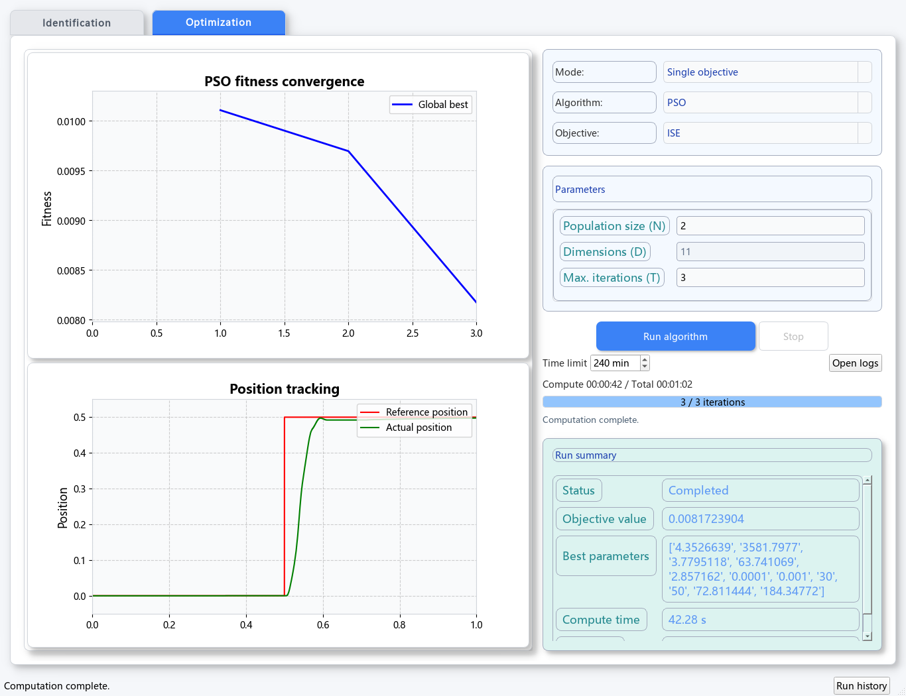
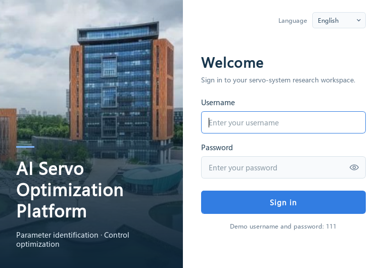

# AI Servo Optimization Platform

[中文](README.md) | **English**

A desktop platform for servo-system parameter identification and controller optimization, built with **Python / PyQt5 and MATLAB / Simulink**. It provides a bilingual interface, algorithm configuration, result visualization and run history.

Developed as the UI and data-management component of Xi'an Jiaotong–Liverpool University's **“AI助力工业控制智能化” (AI for Intelligent Industrial Control)** project, which received a **national first prize in the 2025 fourth university electrical and electronic engineering innovation competition**. **Yuchen Wang** developed this component.



## Features

| Module | Algorithms | Outputs |
| --- | --- | --- |
| Parameter identification | PSO, GA, DE, IA, FA, HPSO | Fitness convergence, identified parameters and best value |
| Single-objective optimization | PSO, GA, DE, IA, FA, HPSO | ITSE / ISE / IAE / ITAE, position tracking |
| Multi-objective optimization | MOGOA, NONMOGOA, LVMOGOA, MDF_MOGOA | Optimization results, HV and position tracking |

- Chinese and English interfaces, including controls, charts and messages.
- Input validation, iteration progress, timing, cancellation and time limits.
- Separate run folders, logs, history, archiving and automatic cleanup.
- Resizable plots and controls, with scrolling for smaller windows.

Multi-objective HV uses fixed physical reference scales for the supplied servo model. Per-iteration objective archives are saved for curve verification; see the [metric notes](matlab_scripts/optimization/multi_objectives/support/README.md).

<details>
<summary>Interface walkthrough and sign-in screen</summary>


The walkthrough includes a saved result from a real MATLAB calculation.



</details>

## Getting started

**Requirements:** Windows x64, MATLAB R2024b, Simulink and Motor Control Blockset. Install and license MATLAB and the required toolboxes separately.

Download or clone the repository, then run these commands from its root:

```powershell
powershell.exe -NoProfile -ExecutionPolicy Bypass -File .\tools\setup_environment.ps1
.\start_ui.bat
```

The installer creates a project-local Python environment. For later launches, double-click **start_ui.bat**.

Use **111** for both the demo username and password. Choose an algorithm, enter parameters and select **Run algorithm**. MATLAB starts automatically.

See the [user guide](docs/user-guide.en.md) for details, or try the small [PSO / ISE example](examples/pso_ise/README.md).

## Repository layout

```text
src/              Desktop interface, translations and run management
matlab_scripts/   Identification, optimization and Simulink models
assets/           Images and interface resources
examples/         Computation examples and reference results
tests/            Automated and real-simulation checks
tools/            Environment setup and startup diagnostics
docs/             Guides and project information
```

The project has passed **66 automated tests, 2 UI smoke checks and real MATLAB computation checks**. See the [validation record](docs/validation.md).

## Author and license

**Yuchen Wang** — UI interaction, MATLAB integration, visualization and data management. Algorithm research, communication and hardware validation were team contributions. See [project background](docs/项目背景.md).

Original Python application, tooling and test code is licensed under **[GPLv3](LICENSE)**. MATLAB algorithms, models and images retain their respective terms; see [third-party notices](THIRD_PARTY_NOTICES.md) and [copyright scope](COPYRIGHT.md).

Questions and suggestions are welcome through [Issues](https://github.com/yuchenwang2302-beep/ai-servo-optimization-platform/issues).
