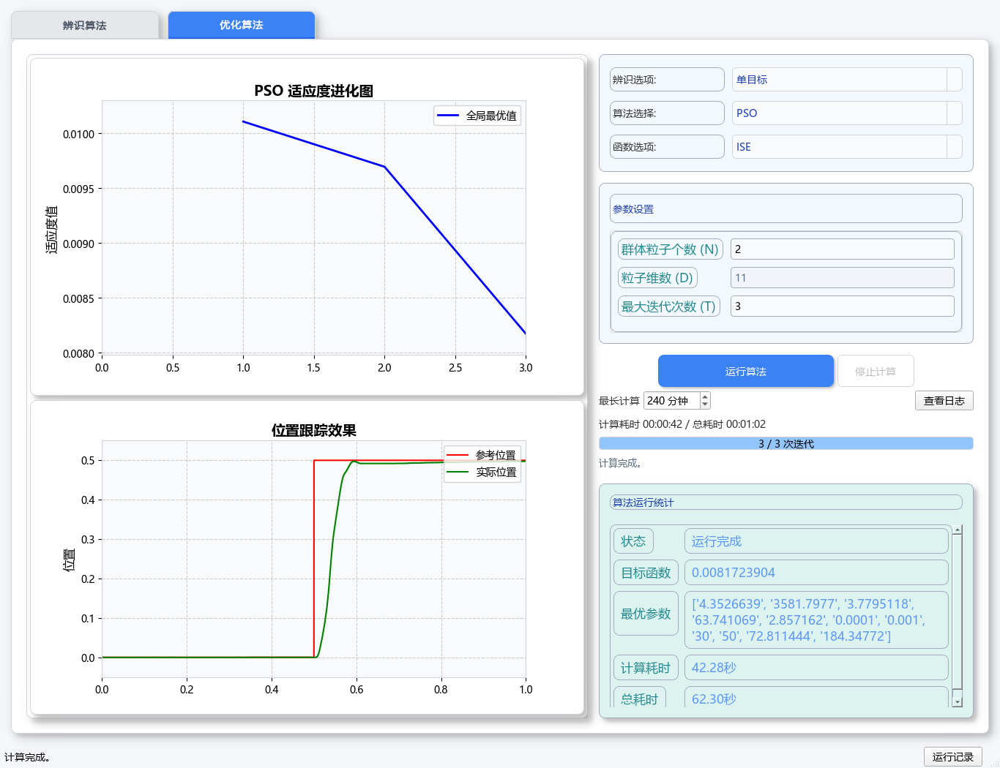
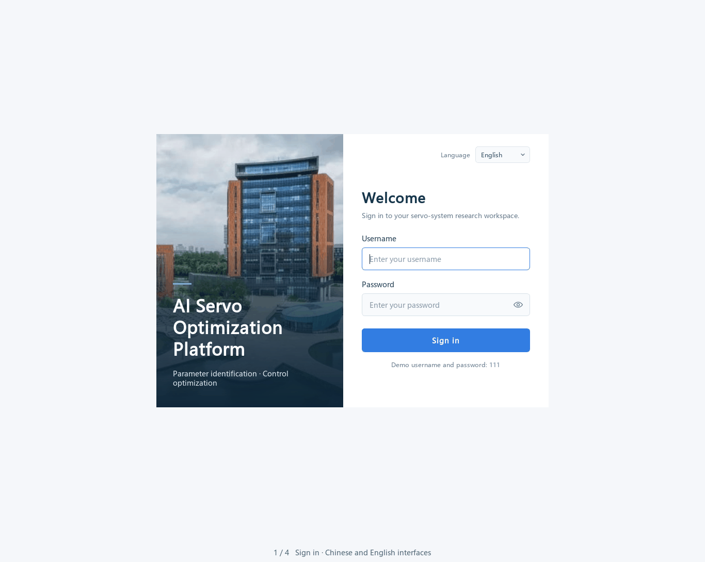

# AI Servo Optimization Platform

**中文** | [English](README.en.md)

基于 **Python / PyQt5 与 MATLAB / Simulink** 的伺服系统参数辨识与控制参数优化平台，支持中英文界面、算法配置、结果可视化和运行记录管理。

本项目是西交利物浦大学 **“AI助力工业控制智能化”** 竞赛作品的界面与数据管理部分，获 **2025 年第四届高校电气电子工程创新大赛全国赛一等奖**。UI 与数据管理模块由 **Yuchen Wang（王雨晨）** 开发。



## 功能

| 模块 | 算法 | 结果展示 |
| --- | --- | --- |
| 参数辨识 | PSO、GA、DE、IA、FA、HPSO | 适应度曲线、辨识参数与最优值 |
| 单目标优化 | PSO、GA、DE、IA、FA、HPSO | ITSE / ISE / IAE / ITAE，位置跟踪曲线 |
| 多目标优化 | MOGOA、NONMOGOA、LVMOGOA、MDF_MOGOA | 多目标优化结果、HV 与位置跟踪曲线 |

- 登录页切换中英文，主界面与图表同步使用所选语言。
- 参数输入校验、迭代进度、计算计时、停止与超时控制。
- 独立运行目录、日志、历史记录、归档与自动清理。
- 图表和参数区随窗口调整，支持小窗口滚动查看。

<details>
<summary>界面导览与登录页</summary>



导览包含一次已保存的真实 MATLAB 计算结果。


</details>

## 快速开始

**环境：** Windows 64 位、MATLAB R2024b、Simulink、Motor Control Blockset。MATLAB 及工具箱需自行安装并完成授权。

下载或克隆仓库后，在项目目录运行：

```powershell
powershell.exe -NoProfile -ExecutionPolicy Bypass -File .\tools\setup_environment.ps1
.\start_ui.bat
```

安装脚本会建立项目专用 Python 环境。以后直接双击 **start_ui.bat** 即可。

演示账号与密码均为 **111**。登录后选择算法、设置参数并点击“运行算法”；MATLAB 会自动启动。

详细操作见 [使用指南](docs/使用指南.md)。想先检查一组小规模计算，可运行 [PSO / ISE 示例](examples/pso_ise/README.md)。

## 项目结构

```text
src/              桌面界面、语言与运行管理
matlab_scripts/   辨识、优化算法及 Simulink 模型
assets/           界面图片与资源
examples/         计算示例与参考结果
tests/            自动测试和真实仿真检查
tools/            环境安装与启动诊断
docs/             使用说明与项目资料
```

项目已通过 **66 项自动测试、2 项界面检查和真实 MATLAB 计算验证**。详见 [测试记录](docs/validation.md)。

## 作者与许可

**Yuchen Wang** — UI 交互、MATLAB 调用集成、可视化与数据管理。算法研究、通信和硬件验证由项目团队共同完成；[项目背景与分工](docs/项目背景.md)。

原创 Python 应用、开发工具和测试代码采用 **[GPLv3](LICENSE)**。MATLAB 算法、模型及图片保留各自条款，来源见 [第三方说明](THIRD_PARTY_NOTICES.md)，授权范围见 [版权说明](COPYRIGHT.md)。

欢迎通过 [Issues](https://github.com/yuchenwang2302-beep/ai-servo-optimization-platform/issues) 反馈问题或建议。
